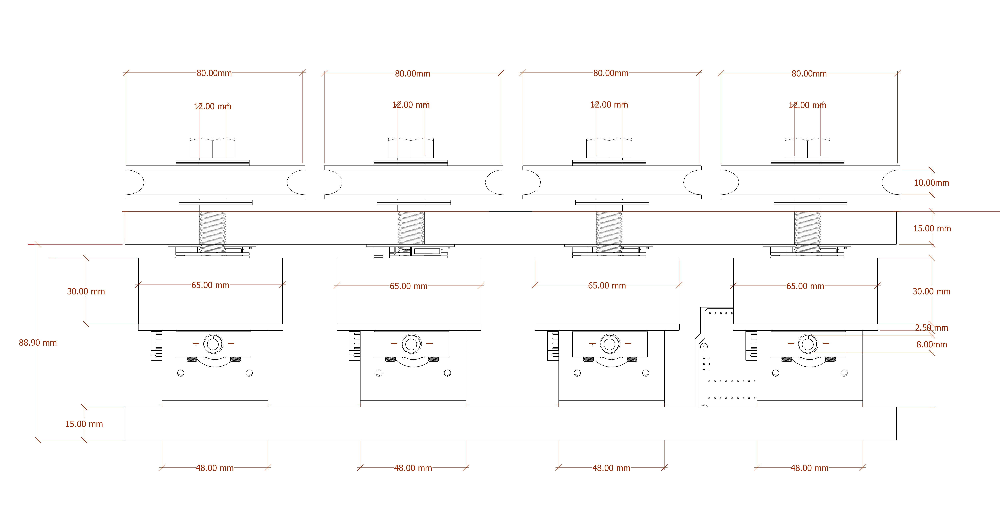

## Metal-Rod-Bending-For-ABB

##### Description
Robot tool for bending metal rods composed by 3-4 stepper motors moving 3-4 metal rollers (actuators) independently in one axis movement.
  


##### Requirements
Components
 
Tool Dimensions





##### Electronics and Hardware
* [Arduino Mega](https://www.amazon.es/ELEGOO-Microcontrolador-ATmega2560-ATmega16U2-Compatible/dp/B06Y3ZHPWC/ref=sr_1_4?__mk_es_ES=%C3%85M%C3%85%C5%BD%C3%95%C3%91&keywords=arduino+Mega&qid=1575988330&sr=8-4)
* [CNC shield GBRL](https://www.amazon.es/Longruner-Tarjeta-Expansi%C3%B3n-Controlador-LK75/dp/B072N4FMRN/ref=sr_1_8?__mk_es_ES=%C3%85M%C3%85%C5%BD%C3%95%C3%91&keywords=grbl&qid=1573215919&sr=8-8&th=1)
* [3-4 Nema 17 Stepper Motors 1.8° 200 steps per revolution](https://www.amazon.es/Longruner-Tarjeta-Expansi%C3%B3n-Controlador-LK75/dp/B072N4FMRN/ref=sr_1_8?__mk_es_ES=%C3%85M%C3%85%C5%BD%C3%95%C3%91&keywords=grbl&qid=1573215919&sr=8-8&th=1)
* [3-4 DRV8825](https://www.amazon.es/Longruner-Tarjeta-Expansi%C3%B3n-Controlador-LK75/dp/B072N4FMRN/ref=sr_1_8?__mk_es_ES=%C3%85M%C3%85%C5%BD%C3%95%C3%91&keywords=grbl&qid=1573215919&sr=8-8&th=1)
* [3-4 Flexible rod coupling 5mm to 8mm NEMA 17. Stepper Shaft Coupling](https://www.amazon.es/Acoplamientos-flexibles-acoplador-impresora-Eewolf/dp/B0783QQMKP/ref=sr_1_4?__mk_es_ES=%C3%85M%C3%85%C5%BD%C3%95%C3%91&keywords=nema+17+couplers&qid=1575985948&sr=8-4)
* [3-4 TR8x8 Trapezoidal Lead Screw 210mm long](https://makershopbcn.com/product/tr8x8-trapezoidal-lead-screw)
* [12V 5A Switching Power Supply](https://www.amazon.es/HAILI-Switching-Monitoring-Equipment-Surveillance/dp/B07PW8GYB8/ref=sr_1_23?__mk_es_ES=%C3%85M%C3%85%C5%BD%C3%95%C3%91&keywords=12v+power+supply&qid=1575990967&sr=8-23)
* [Anti-backlash Nut Block TR8x8](https://makershopbcn.com/product/anti-backlash-nut-block-delrin-lead-screw-tr8x8)
* [V-Slot Gantry Plate](https://makershopbcn.com/product/gantry-plate-v-slot)
* [Metal Rollers 80mm Diameter](https://www.amazon.es/Estebro-124-Polea-80x20-U/dp/B00ITVWASC/ref=sr_1_2?__mk_es_ES=%C3%85M%C3%85%C5%BD%C3%95%C3%91&keywords=poleas+metalicas&qid=1575991802&sr=8-2)


##### Software

This project uses a grasshopper script to send the motor positions depending on the bespoke curve you want to an ABB 120 or 140. Subsequently an Optocoupler converts the 24V signals from a robot-arm into 5V logical level signal for the Arduino in order to introduce an I/O control each of the 3-4 motors of the tool.

Data Flow


##### Getting Started

Grasshopper Setup:


Grasshopper Motor Positions (Grasshopper Script)


Arduino Setup:


```//Void Setup

// setup pins numbers

//X motor pins
const int stepX = 2;
const int dirX  = 5;

//Y motor pins
const int stepY = 3;
const int dirY  = 6;

//Z motor pins
const int stepZ = 4;
const int dirZ  = 7;

const int enPin = 8;


/////////////////////////////

int StateInput = 50;

int CurrentState;
int PreviousState;

/////////////////////////////

void setup() {

  // Sets inputs and outputs
  //X motor pins
  pinMode(stepX, OUTPUT);
  pinMode(dirX, OUTPUT);

  //Y motor pins
  pinMode(stepY, OUTPUT);
  pinMode(dirY, OUTPUT);

  //Z motor pins
  pinMode(stepZ, OUTPUT);
  pinMode(dirZ, OUTPUT);

  //what is this??
  pinMode(enPin, OUTPUT);
  digitalWrite(enPin, LOW);

//Arduino Mega Ports
// PA0 - PA7  (22,23,24,25,26,27,28,29)
// PC0 - PC7  (30,31,32,33,34,35,36,37)
// PL0 - PL7  (42,43,44,45,46,47,48,49)
// PB0 - PB7  (50,51,52,53,4,5,6,7)
// PF0 - PF7  (A0,A1,A2,A3,A4,A5,A6,A7)
// PK0 - PK7   (A8,A9,A10,A11,A12,A13,A14,A15)

//set port PC0 - PC7 all as inputs
DDRC = B11110000; //sets pins (30,31,32,33,34,35,36,37) as INPUT(0) for amount of steps
//set port PL0 - PCL all as inputs
DDRL = B11111000; //sets pins (42,43,44,45,46,47,48,49) as INPUT(0) for choosing dir

pinMode(StateInput, INPUT);

Serial.begin(9600);
}


///////////////////////////////

void loop() {

  CurrentState = digitalRead(StateInput);

if(CurrentState != PreviousState) {

  delay(1000);

//get input from PortC and convert binary to integer
 int AmountOfSteps = (15-PINC) * 100; //reads PORTB inputs

 //get input from PortL to choose DIR
 int Dir = 7-PINL; //reads PORTB inputs

Serial.println("====");
//Serial.println(AmountOfSteps);
//Serial.println(Dir);
Serial.println(AmountOfSteps, DEC);
Serial.println(Dir, DEC);

//X positive direction
if (Dir == 1) {  
  // Set the spinning direction clockwise:
  digitalWrite(dirX, HIGH);
  // Spin the stepper motor 1 revolution slowly:
  for (int i = 0; i < AmountOfSteps; i++) {
    // These four lines result in 1 step:
    digitalWrite(stepX, HIGH);
    delayMicroseconds(2000);
    digitalWrite(stepX, LOW);
    delayMicroseconds(2000);
  }
}


//X negative direction
if (Dir == 2) {  
  // Set the spinning direction counter clockwise:
  digitalWrite(dirX, LOW);
  // Spin the stepper motor 1 revolution slowly:
  for (int i = 0; i < AmountOfSteps; i++) {
    // These four lines result in 1 step:
    digitalWrite(stepX, HIGH);
    delayMicroseconds(2000);
    digitalWrite(stepX, LOW);
    delayMicroseconds(2000);
  }
}


//Y positive direction
if (Dir == 3) {  
  // Set the spinning direction clockwise:
  digitalWrite(dirY, HIGH);
  // Spin the stepper motor 1 revolution slowly:
  for (int i = 0; i < AmountOfSteps; i++) {
    // These four lines result in 1 step:
    digitalWrite(stepY, HIGH);
    delayMicroseconds(2000);
    digitalWrite(stepY, LOW);
    delayMicroseconds(2000);
  }
}


//Y negative direction
if (Dir == 4) {  
  // Set the spinning direction counter clockwise:
  digitalWrite(dirY, LOW);
  // Spin the stepper motor 1 revolution slowly:
  for (int i = 0; i < AmountOfSteps; i++) {
    // These four lines result in 1 step:
    digitalWrite(stepY, HIGH);
    delayMicroseconds(2000);
    digitalWrite(stepY, LOW);
    delayMicroseconds(2000);
  }
}


//Z positive direction
if (Dir == 5) {  
  // Set the spinning direction clockwise:
  digitalWrite(dirZ, HIGH);
  // Spin the stepper motor 1 revolution slowly:
  for (int i = 0; i < AmountOfSteps; i++) {
    // These four lines result in 1 step:
    digitalWrite(stepZ, HIGH);
    delayMicroseconds(2000);
    digitalWrite(stepZ, LOW);
    delayMicroseconds(2000);
  }
}


//Z negative direction
if (Dir == 6) {  
  // Set the spinning direction counter clockwise:
  digitalWrite(dirZ, LOW);
  // Spin the stepper motor 1 revolution slowly:
  for (int i = 0; i < AmountOfSteps; i++) {
    // These four lines result in 1 step:
    digitalWrite(stepZ, HIGH);
    delayMicroseconds(2000);
    digitalWrite(stepZ, LOW);
    delayMicroseconds(2000);
  }
}
delay(50);
}
PreviousState = CurrentState;

}
```
**References:**

* [Wave Pavilion](https://www.archdaily.com/79693/wave-pavilion-macdowell-tomova)


* [Hague, McConnell Studios](https://www.mattmcconnell.com/hague)


**Credits**
_Based on IAAC publishing guidelines:
(Metal Rod Bending for ABB) is a project of IaaC, Institute for Advanced Architecture of Catalonia. developed at Master in Robotics and Advanced Construction in 2019-2020 by:
Students: (Alexandros Michail Varvantakis, Cedric Droogmans, Roberto Vargas Calvo, Beril Serbes)
Faculty: (Angel Muñoz)_
